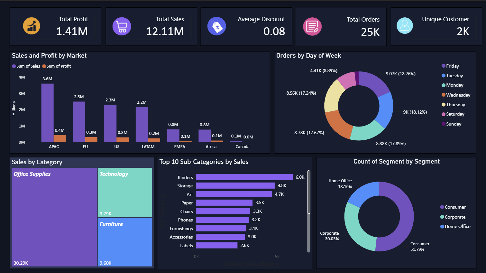
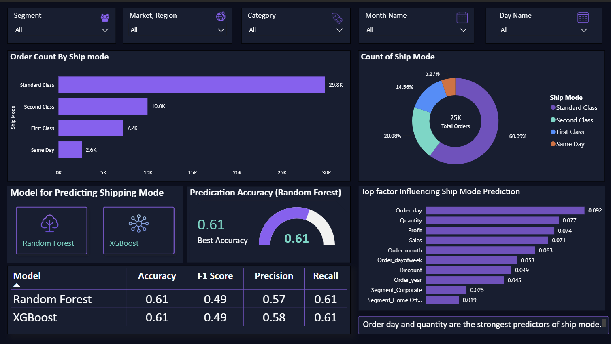

# Superstore Ship Mode Prediction

This project focuses on predicting the **Ship Mode** of orders in the Superstore dataset using machine learning techniques.  
It combines data preprocessing, classification modeling, and a Power BI dashboard for high-level analysis and presentation.

---

## Dashboard Preview

### Dashboard Overview


### Ship Mode Prediction


---
## Project Overview

The goal of this project is to build a supervised **classification model** that predicts how an order will be shipped based on customer, product, order, and geographic information.

The project workflow includes:
- data loading and merging
- exploratory data analysis
- feature engineering and preprocessing
- class imbalance handling
- machine learning model training and evaluation
- data export for reporting and dashboarding

---

## Dataset

The project uses multiple Superstore tables, including:
- customer
- product
- order
- shipping
- geography
- returns

These tables are merged into a single analytical dataset for modeling.

---

## Target Variable

- **Ship Mode**

This is treated as a multi-class classification problem.

---

## Modeling Approach

The following steps are implemented in the notebook/script:

- categorical encoding
- numeric feature scaling
- class balancing using **SMOTE**
- model training and tuning
- performance evaluation

### Models Used
- Random Forest Classifier
- XGBoost Classifier

### Evaluation Metrics
- Accuracy
- F1 Score
- Precision
- Recall

---

## Power BI Dashboard

A Power BI dashboard is included to support:
- high-level analysis of shipping behavior
- comparison of ship mode distributions
- visualization of model performance metrics

The dashboard complements the machine learning workflow and is intended for presentation and exploration rather than detailed model development.

---

## Output Files

- `Product_Sales_Info.xlsx` — cleaned and merged dataset used for analysis
- `ship_mode_prediction_dashboard.pbix` — Power BI dashboard file

---

## Technologies Used

- Python
- Pandas, NumPy
- Scikit-learn
- Imbalanced-learn
- XGBoost
- Matplotlib, Seaborn, Plotly
- Power BI

---

## Installation

Install the required Python packages:
```bash
pip install -r requirements.txt
